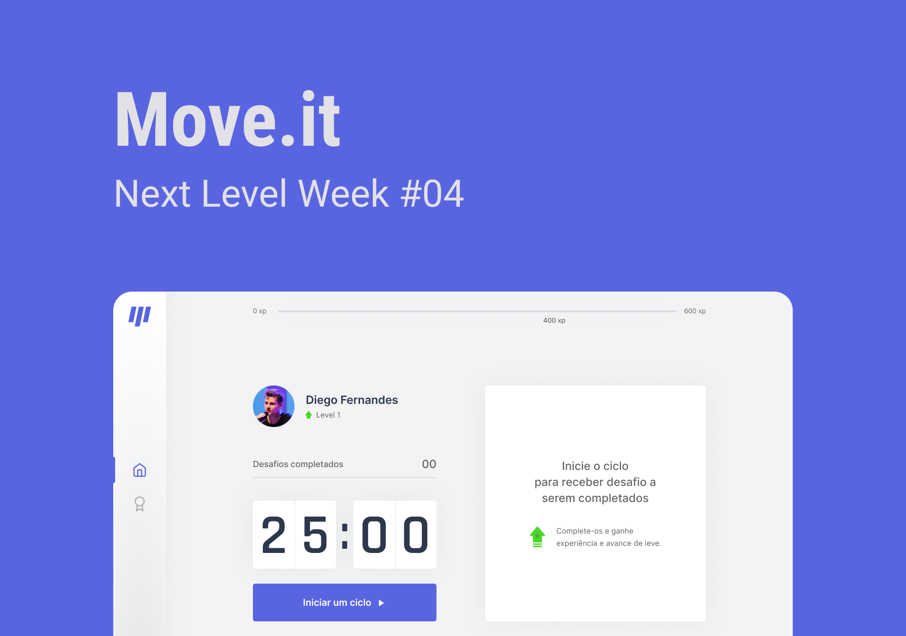

<div align="center">
  <a href="https://move-next-delta.vercel.app/"></a>
</div>
<br />
<div align="center">
  
  
  <a href="https://github.com/myguelangello/nlw-4/blob/main/LICENSE">
    
  </a>
</div>
<div align="center">
  <h2>
    
  </h2>
</div>

<div>
  <h2>🧪 Tecnologias</h2>
  <div>
    <p>Esse projeto foi desenvolvido com as seguintes tecnologias:</p>
    <ul>
      <li><a href="https://pt-br.reactjs.org/">React</a></li>
      <li><a href="https://www.typescriptlang.org/">TypeScript</a></li>
      <li><a href="https://nextjs.org/docs/getting-started">Next.js</a></li>
    </ul>
  </div>
</div>

<div>
  <h2>🚧 Começando</h2>
  <div>
    <p>Essas instruções fornecerão uma cópia do projeto em sua máquina local para fins de desenvolvimento e teste.</p>
    <p>
      Para clonar e executar esta aplicação você precisará do Git e o Node.js instalado na sua máquina. O projeto pode ser construído com npm ou yarn, então escolha uma das abordagens abaixocaso você  não tenha nenhum instalado em seu sistema.
    </p>
    <ul>
      <li>
        O Npm é distribuído com o Node.js, o que significa que quando você faz o download do Node.js, o npm é instalado automaticamente no seu computador. 
        <a href="https://nodejs.org/en/download/">Baixe o Node.js</a>
      </li>
      <li>
        Yarn é um gerenciador de pacotes criado pela equipe do Facebook e parece ser mais rápido do que o npm em geral. 
        <a href="https://classic.yarnpkg.com/en/docs/install/#windows-stable">Baixar Yarn</a>
      </li>
    </ul>
  </div>
</div>

<div>
  <h2>🚀 Como executar</h2>
  <p>Para baixar o projeto siga as instruções abaixo:</p> 
  <ul>
    <li>Clone o projeto e acesse a pasta do mesmo.</li>
    
  ```bash
  $ git clone https://github.com/myguelangello/nlw-4
  $ cd nlw-4
  ```
  </ul>
  <ul>
    <li>
      Instale as dependências e inicie o projeto com Yarn:
    </li>
    
  ```bash
  #Instalar as dependências
  $ yarn install
  
  #Iniciar o projeto
  $ yarn start
  ```
   </ul>
   <ul>
     <li>
       Ou Instale as dependências e inicie o projeto com NPM
     </li>
     
  ```bash
  #Instalar as dependências
  $ npm install
  
  #Iniciar o projeto
  $ npm start
  ```
  </ul>
  <p>O app estará disponível no seu browser pelo endereço <a href="http://localhost:3000">http://localhost:3000</a>.</p>
</div>


<div>
  <h2>💻 Projeto</h2>
  <div>
    <p> 
      O <a href="https://move-next-delta.vercel.app/">Move-it</a> 
      é um app que une a técnica de Pomodoro com a realização de exercícios físicos simples para quem passa muito tempo na frente do computador.
    </p>
    <p>
      Este é um projeto desenvolvido durante a Next Level Week #4, na trilha de ReactJS.
    </p>
  </div>
</div>

<div>
  <h2>✅ Features</h2>
  <div>
    <ul>
      <li>Countdown de 25 minutos para o tempo de concentração</li>
      <li>Notificação de novo desafio</li>
      <li>Desafios simples e práticos</li>
      <li>Upar de level</li>
    </ul>
  </div>
</div>

<div>
  <h2>📌 Autor</h2>
  <div>
    
    <p>Feito com ❤️ & ☕ por Myguel Angello,  👋🏽 entre em contato</p>
    <p>Estudante de Sistemas e Mídias Digitais | UFC</p>
    <a href="https://www.linkedin.com/in/myguelangello/">
      
    </a>
    <a href="https://www.instagram.com/_myguel/">
      
    </a>
      
  </div>
</div>
 <div>
  <br />
  <h2>📃 Licença</h2>
  <div>
    <p>
      Esse projeto está sob a licença MIT. Veja o arquivo <a href="https://github.com/myguelangello/nlw-4/blob/main/LICENSE">LICENSE</a> para mais detalhes.
    </p>
    <br />
    <a href="https://github.com/myguelangello/nlw-4/blob/main/LICENSE">
      
    </a>
  </div>
</div>
